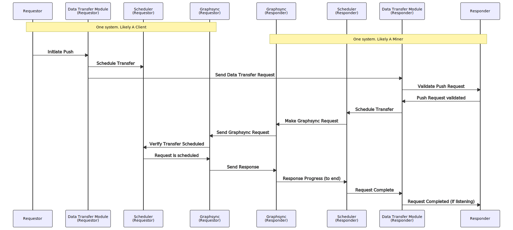
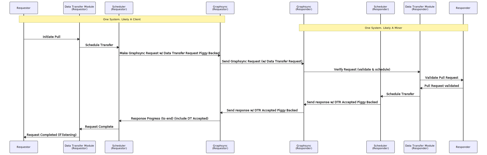

# Files and data

Filecoin’s primary aim is to store client’s Files and Data. This section details data structures and tooling related to working with files, chunking, encoding, graph representations, `Pieces`, storage abstractions, and more.

## File <a href="#section-systems.filecoin_files.file" id="section-systems.filecoin_files.file"></a>

Example:

```go
// Path is an opaque locator for a file (e.g. in a unix-style filesystem).
type Path string

// File is a variable length data container.
// The File interface is modeled after a unix-style file, but abstracts the
// underlying storage system.
type File interface {
    Path()   Path
    Size()   int
    Close()  error

    // Read reads from File into buf, starting at offset, and for size bytes.
    Read(offset int, size int, buf Bytes) struct {size int, e error}

    // Write writes from buf into File, starting at offset, and for size bytes.
    Write(offset int, size int, buf Bytes) struct {size int, e error}
}
```

### **FileStore - Local Storage for Files**

The `FileStore` is an abstraction used to refer to any underlying system or device that Filecoin will store its data to. It is based on Unix filesystem semantics, and includes the notion of `Paths`. This abstraction is here in order to make sure Filecoin implementations make it easy for end-users to replace the underlying storage system with whatever suits their needs. The simplest version of `FileStore` is just the host operating system’s file system.

Example:

```go
// FileStore is an object that can store and retrieve files by path.
type FileStore struct {
    Open(p Path)           union {f File, e error}
    Create(p Path)         union {f File, e error}
    Store(p Path, f File)  error
    Delete(p Path)         error

    // maybe add:
    // Copy(SrcPath, DstPath)
}
```

#### **Varying user needs**

Filecoin user needs vary significantly, and many users – especially miners – will implement complex storage architectures underneath and around Filecoin. The `FileStore` abstraction is here to make it easy for these varying needs to be easy to satisfy. All file and sector local data storage in the Filecoin Protocol is defined in terms of this `FileStore` interface, which makes it easy for implementations to make swappable, and for end-users to swap out with their system of choice.

#### **Implementation examples**

The `FileStore` interface may be implemented by many kinds of backing data storage systems. For example:

* The host Operating System file system
* Any Unix/Posix file system
* RAID-backed file systems
* Networked of distributed file systems (NFS, HDFS, etc)
* IPFS
* Databases
* NAS systems
* Raw serial or block devices
* Raw hard drives (hdd sectors, etc)

Implementations SHOULD implement support for the host OS file system. Implementations MAY implement support for other storage systems.

## The Filecoin Piece <a href="#section-systems.filecoin_files.piece" id="section-systems.filecoin_files.piece"></a>

The _Filecoin Piece_ is the main _unit of negotiation_ for data that users store on the Filecoin network. The Filecoin Piece is _not a unit of storage_, it is not of a specific size, but is upper-bounded by the size of the _Sector_. A Filecoin Piece can be of any size, but if a Piece is larger than the size of a Sector that the miner supports it has to be split into more Pieces so that each Piece fits into a Sector.

A `Piece` is an object that represents a whole or part of a `File`, and is used by `Storage Clients` and `Storage Miners` in `Deals`. `Storage Clients` hire `Storage Miners` to store `Pieces`.

The Piece data structure is designed for proving storage of arbitrary IPLD graphs and client data. This diagram shows the detailed composition of a Piece and its proving tree, including both full and bandwidth-optimized Piece data structures.

<figure><figcaption><p><a href="https://spec.filecoin.io/#figure-pieces-proving-trees-and-piece-data-structures">Figure: Pieces, Proving Trees, and Piece Data Structures</a> </p></figcaption></figure>

### **Data Representation**

It is important to highlight that data submitted to the Filecoin network go through several transformations before they come to the format at which the `StorageProvider` stores it.

Below is the process followed from the point a user starts preparing a file to store in Filecoin to the point that the provider produces all the identifiers of Pieces stored in a Sector.

The first three steps take place on the client side.

1. When a client wants to store a file in the Filecoin network, they start by producing the IPLD DAG of the file. The hash that represents the root node of the DAG is an IPFS-style CID, called _Payload CID_.
2. In order to make a _Filecoin Piece_, the IPLD DAG is serialised into a [“Content-Addressable aRchive” (.car)](https://github.com/ipld/specs/blob/master/block-layer/content-addressable-archives.md#summary) file, which is in raw bytes format. A CAR file is an opaque blob of data that packs together and transfers IPLD nodes. The _Payload CID_ is common between the CAR’ed and un-CAR’ed constructions. This helps later during data retrieval, when data is transferred between the storage client and the storage provider as we discuss later.
3. The resulting .car file is _padded_ with extra zero bits in order for the file to make a binary Merkle tree. To achieve a clean binary Merkle Tree the .car file size has to be in some power of two (^2) size. A padding process, called `Fr32 padding`, which adds two (2) zero bits to every 254 out of every 256 bits is applied to the input file. At the next step, the padding process takes the output of the `Fr32 padding` process and finds the size above it that makes for a power of two size. This gap between the result of the `Fr32 padding` and the next power of two size is padded with zeros.

In order to justify the reasoning behind these steps, it is important to understand the overall negotiation process between the `StorageClient` and a `StorageProvider`. The piece CID or CommP is what is included in the deal that the client negotiates and agrees with the storage provider. When the deal is agreed, the client sends the file to the provider (using GraphSync). The provider has to construct the CAR file out of the file received and derive the Piece CID on their side. In order to avoid the client sending a different file to the one agreed, the Piece CID that the provider generates has to be the same as the one included in the deal negotiated earlier.

The following steps take place on the `StorageProvider` side (apart from step 4 that can also take place at the client side).

4. Once the `StorageProvider` receives the file from the client, they calculate the Merkle root out of the hashes of the Piece (padded .car file). The resulting root of the clean binary Merkle tree is the **Piece CID**. This is also referred to as _CommP_ or _Piece Commitment_ and as mentioned earlier, has to be the same with the one included in the deal.
5. The Piece is included in a Sector together with data from other deals. The `StorageProvider` then calculates Merkle root for all the Pieces inside the Sector. The root of this tree is _CommD_ (aka _Commitment of Data_ or `UnsealedSectorCID`).
6. The `StorageProvider` is then sealing the sector and the root of the resulting Merkle root is the _CommRLast_.
7. Proof of Replication (PoRep), SDR in particular, generates another Merkle root hash called _CommC_, as an attestation that replication of the data whose commitment is _CommD_ has been performed correctly.
8. Finally, _CommR_ (or _Commitment of Replication_) is the hash of CommC || CommRLast.

**IMPORTANT NOTES:**

* `Fr32` is a 32-bit representation of a field element (which, in our case, is the arithmetic field of BLS12-381). To be well-formed, a value of type `Fr32` must _actually_ fit within that field, but this is not enforced by the type system. It is an invariant which must be perserved by correct usage. In the case of so-called `Fr32 padding`, two zero bits are inserted ‘after’ a number requiring at most 254 bits to represent. This guarantees that the result will be `Fr32`, regardless of the value of the initial 254 bits. This is a ‘conservative’ technique, since for some initial values, only one bit of zero-padding would actually be required.
* Steps 2 and 3 above are specific to the Lotus implementation. The same outcome can be achieved in different ways, e.g., without using `Fr32` bit-padding. However, any implementation has to make sure that the initial IPLD DAG is serialised and padded so that it gives a clean binary tree, and therefore, calculating the Merkle root out of the resulting blob of data gives the same **Piece CID**. As long as this is the case, implementations can deviate from the first three steps above.
* Finally, it is important to add a note related to the _Payload CID_ (discussed in the first two steps above) and the data retrieval process. The retrieval deal is negotiated on the basis of the _Payload CID_. When the retrieval deal is agreed, the retrieval miner starts sending the unsealed and “un-CAR’ed” file to the client. The transfer starts from the root node of the IPLD Merkle Tree and in this way the client can validate the _Payload CID_ from the beginning of the transfer and verify that the file they are receiving is the file they negotiated in the deal and not random bits.

### **PieceStore**

The `PieceStore` module allows for storage and retrieval of Pieces from some local storage. The piecestore’s main goal is to help the [storage](https://github.com/filecoin-project/go-fil-markets/blob/master/storagemarket) and [retrieval market](https://github.com/filecoin-project/go-fil-markets/blob/master/retrievalmarket) modules to find where sealed data lives inside of sectors. The storage market writes the data, and retrieval market reads it in order to send out to retrieval clients.

The implementation of the PieceStore module can be found [here](https://github.com/filecoin-project/go-fil-markets/tree/master/piecestore).

## Data Transfer in Filecoin <a href="#section-systems.filecoin_files.data_transfer" id="section-systems.filecoin_files.data_transfer"></a>

The _Data Transfer Protocol_ is a protocol for transferring all or part of a `Piece` across the network when a deal is made. The overall goal for the data transfer module is for it to be an abstraction of the underlying transport medium over which data is transferred between different parties in the Filecoin network. Currently, the underlying medium or protocol used to actually do the data transfer is GraphSync. As such, the Data Transfer Protocol can be thought of as a negotiation protocol.

The Data Transfer Protocol is used both for Storage and for Retrieval Deals. In both cases, the data transfer request is initiated by the client. The primary reason for this is that clients will more often than not be behind NATs and therefore, it is more convenient to start any data transfer from their side. In the case of Storage Deals the data transfer request is initiated as a _push request_ to send data to the storage provider. In the case of Retrieval Deals the data transfer request is initiated as a _pull request_ to retrieve data by the storage provider.

The request to initiate a data transfer includes a voucher or token (none to be confused with the Payment Channel voucher) that points to a specific deal that the two parties have agreed to before. This is so that the storage provider can identify and link the request to a deal it has agreed to and not disregard the request. As described below the case might be slightly different for retrieval deals, where both a deal proposal and a data transfer request can be sent at once.

### **Modules**

This diagram shows how Data Transfer and its modules fit into the picture with the Storage and Retrieval Markets. In particular, note how the Data Transfer Request Validators from the markets are plugged into the Data Transfer module, but their code belongs in the Markets system.

<figure><figcaption><p><a href="https://spec.filecoin.io/#figure-data-transfer">Figure: Data Transfer</a> </p></figcaption></figure>

### **Terminology**

* **Push Request**: A request to send data to the other party - normally initiated by the client and primarily in case of a Storage Deal.
* **Pull Request**: A request to have the other party send data - normally initiated by the client and primarily in case of a Retrieval Deal.
* **Requestor**: The party that initiates the data transfer request (whether Push or Pull) - normally the client, at least as currently implemented in Filecoin, to overcome NAT-traversal problems.
* **Responder**: The party that receives the data transfer request - normally the storage provider.
* **Data Transfer Voucher or Token**: A wrapper around storage- or retrieval-related data that can identify and validate the transfer request to the other party.
* **Request Validator**: The data transfer module only initiates a transfer when the responder can validate that the request is tied directly to either an existing storage or retrieval deal. Validation is not performed by the data transfer module itself. Instead, a request validator inspects the data transfer voucher to determine whether to respond to the request or disregard the request.
* **Transporter**: Once a request is negotiated and validated, the actual transfer is managed by a transporter on both sides. The transporter is part of the data transfer module but is isolated from the negotiation process. It has access to an underlying verifiable transport protocol and uses it to send data and track progress.
* **Subscriber**: An external component that monitors progress of a data transfer by subscribing to data transfer events, such as progress or completion.
* **GraphSync**: The default underlying transport protocol used by the Transporter. The full graphsync specification can be found [here](https://github.com/ipld/specs/blob/master/block-layer/graphsync/graphsync.md)

### **Request Phases**

There are two basic phases to any data transfer:

1. Negotiation: the requestor and responder agree to the transfer by validating it with the data transfer voucher.
2. Transfer: once the negotiation phase is complete, the data is actually transferred. The default protocol used to do the transfer is Graphsync.

Note that the Negotiation and Transfer stages can occur in separate round trips, or potentially the same round trip, where the requesting party implicitly agrees by sending the request, and the responding party can agree and immediately send or receive data. Whether the process is taking place in a single or multiple round-trips depends in part on whether the request is a push request (storage deal) or a pull request (retrieval deal), and on whether the data transfer negotiation process is able to piggy back on the underlying transport mechanism. In the case of GraphSync as transport mechanism, data transfer requests can piggy back as an extension to the GraphSync protocol using [GraphSync’s built-in extensibility](https://github.com/ipld/specs/blob/master/block-layer/graphsync/graphsync.md#extensions). So, only a single round trip is required for Pull Requests. However, because Graphsync is a request/response protocol with no direct support for `push` type requests, in the Push case, negotiation happens in a seperate request over data transfer’s own libp2p protocol `/fil/datatransfer/1.0.0`. Other future transport mechinisms might handle both Push and Pull, either, or neither as a single round trip. Upon receiving a data transfer request, the data transfer module does the decoding the voucher and delivers it to the request validators. In storage deals, the request validator checks if the deal included is one that the recipient has agreed to before. For retrieval deals the request includes the proposal for the retrieval deal itself. As long as request validator accepts the deal proposal, everything is done at once as a single round-trip.

It is worth noting that in the case of retrieval the provider can accept the deal and the data transfer request, but then pause the retrieval itself in order to carry out the unsealing process. The storage provider has to unseal all of the requested data before initiating the actual data transfer. Furthermore, the storage provider has the option of pausing the retrieval flow before starting the unsealing process in order to ask for an unsealing payment request. Storage providers have the option to request for this payment in order to cover unsealing computation costs and avoid falling victims of misbehaving clients.

### **Example Flows**

#### **Push Flow**

<figure><figcaption></figcaption></figure>

1. A requestor initiates a Push transfer when it wants to send data to another party.
2. The requestors' data transfer module will send a push request to the responder along with the data transfer voucher.
3. The responder’s data transfer module validates the data transfer request via the Validator provided as a dependency by the responder.
4. The responder’s data transfer module initiates the transfer by making a GraphSync request.
5. The requestor receives the GraphSync request, verifies that it recognises the data transfer and begins sending data.
6. The responder receives data and can produce an indication of progress.
7. The responder completes receiving data, and notifies any listeners.

The push flow is ideal for storage deals, where the client initiates the data transfer straightaway once the provider indicates their intent to accept and publish the client’s deal proposal.

### **Pull Flow - Single Round Trip**

<figure><figcaption></figcaption></figure>

1. A requestor initiates a Pull transfer when it wants to receive data from another party.
2. The requestor’s data transfer module initiates the transfer by making a pull request embedded in the GraphSync request to the responder. The request includes the data transfer voucher.
3. The responder receives the GraphSync request, and forwards the data transfer request to the data transfer module.
4. The responder’s data transfer module validates the data transfer request via a PullValidator provided as a dependency by the responder.
5. The responder accepts the GraphSync request and sends the accepted response along with the data transfer level acceptance response.
6. The requestor receives data and can produce an indication of progress. This timing of this step comes later in time, after the storage provider has finished unsealing the data.
7. The requestor completes receiving data, and notifies any listeners.

### **Protocol**

A data transfer CAN be negotiated over the network via the Data Transfer Protocol, a libp2p protocol type.

Using the Data Transfer Protocol as an independent libp2p communciation mechanism is not a hard requirement – as long as both parties have an implementation of the Data Transfer Subsystem that can talk to the other, any transport mechanism (including offline mechanisms) is acceptable.

### **Data Structures**

Example: Data Transfer Types&#x20;

```go
package datatransfer

import (
	"fmt"
	"time"

	"github.com/ipfs/go-cid"
	"github.com/ipld/go-ipld-prime"
	"github.com/libp2p/go-libp2p-core/peer"
	cbg "github.com/whyrusleeping/cbor-gen"

	"github.com/filecoin-project/go-data-transfer/encoding"
)

//go:generate cbor-gen-for ChannelID ChannelStages ChannelStage Log

// TypeIdentifier is a unique string identifier for a type of encodable object in a
// registry
type TypeIdentifier string

// EmptyTypeIdentifier means there is no voucher present
const EmptyTypeIdentifier = TypeIdentifier("")

// Registerable is a type of object in a registry. It must be encodable and must
// have a single method that uniquely identifies its type
type Registerable interface {
	encoding.Encodable
	// Type is a unique string identifier for this voucher type
	Type() TypeIdentifier
}

// Voucher is used to validate
// a data transfer request against the underlying storage or retrieval deal
// that precipitated it. The only requirement is a voucher can read and write
// from bytes, and has a string identifier type
type Voucher Registerable

// VoucherResult is used to provide option additional information about a
// voucher being rejected or accepted
type VoucherResult Registerable

// TransferID is an identifier for a data transfer, shared between
// request/responder and unique to the requester
type TransferID uint64

// ChannelID is a unique identifier for a channel, distinct by both the other
// party's peer ID + the transfer ID
type ChannelID struct {
	Initiator peer.ID
	Responder peer.ID
	ID        TransferID
}

func (c ChannelID) String() string {
	return fmt.Sprintf("%s-%s-%d", c.Initiator, c.Responder, c.ID)
}

// OtherParty returns the peer on the other side of the request, depending
// on whether this peer is the initiator or responder
func (c ChannelID) OtherParty(thisPeer peer.ID) peer.ID {
	if thisPeer == c.Initiator {
		return c.Responder
	}
	return c.Initiator
}

// Channel represents all the parameters for a single data transfer
type Channel interface {
	// TransferID returns the transfer id for this channel
	TransferID() TransferID

	// BaseCID returns the CID that is at the root of this data transfer
	BaseCID() cid.Cid

	// Selector returns the IPLD selector for this data transfer (represented as
	// an IPLD node)
	Selector() ipld.Node

	// Voucher returns the voucher for this data transfer
	Voucher() Voucher

	// Sender returns the peer id for the node that is sending data
	Sender() peer.ID

	// Recipient returns the peer id for the node that is receiving data
	Recipient() peer.ID

	// TotalSize returns the total size for the data being transferred
	TotalSize() uint64

	// IsPull returns whether this is a pull request
	IsPull() bool

	// ChannelID returns the ChannelID for this request
	ChannelID() ChannelID

	// OtherPeer returns the counter party peer for this channel
	OtherPeer() peer.ID
}

// ChannelState is channel parameters plus it's current state
type ChannelState interface {
	Channel

	// SelfPeer returns the peer this channel belongs to
	SelfPeer() peer.ID

	// Status is the current status of this channel
	Status() Status

	// Sent returns the number of bytes sent
	Sent() uint64

	// Received returns the number of bytes received
	Received() uint64

	// Message offers additional information about the current status
	Message() string

	// Vouchers returns all vouchers sent on this channel
	Vouchers() []Voucher

	// VoucherResults are results of vouchers sent on the channel
	VoucherResults() []VoucherResult

	// LastVoucher returns the last voucher sent on the channel
	LastVoucher() Voucher

	// LastVoucherResult returns the last voucher result sent on the channel
	LastVoucherResult() VoucherResult

	// ReceivedCids returns the cids received so far on the channel
	ReceivedCids() []cid.Cid

	// ReceivedCidsLen returns the number of unique cids received so far on the channel
	ReceivedCidsLen() int

	// ReceivedCidsTotal returns the number of (non-unique) cids received so far
	// on the channel - note that a block can exist in more than one place in the DAG
	ReceivedCidsTotal() int64

	// Queued returns the number of bytes read from the node and queued for sending
	Queued() uint64

	// Stages returns the timeline of events this data transfer has gone through,
	// for observability purposes.
	//
	// It is unsafe for the caller to modify the return value, and changes
	// may not be persisted. It should be treated as immutable.
	Stages() *ChannelStages
}

// ChannelStages captures a timeline of the progress of a data transfer channel,
// grouped by stages.
//
// EXPERIMENTAL; subject to change.
type ChannelStages struct {
	// Stages contains an entry for every stage the channel has gone through.
	// Each stage then contains logs.
	Stages []*ChannelStage
}

// ChannelStage traces the execution of a data transfer channel stage.
//
// EXPERIMENTAL; subject to change.
type ChannelStage struct {
	// Human-readable fields.
	// TODO: these _will_ need to be converted to canonical representations, so
	//  they are machine readable.
	Name        string
	Description string

	// Timestamps.
	// TODO: may be worth adding an exit timestamp. It _could_ be inferred from
	//  the start of the next stage, or from the timestamp of the last log line
	//  if this is a terminal stage. But that's non-determistic and it relies on
	//  assumptions.
	CreatedTime cbg.CborTime
	UpdatedTime cbg.CborTime

	// Logs contains a detailed timeline of events that occurred inside
	// this stage.
	Logs []*Log
}

// Log represents a point-in-time event that occurred inside a channel stage.
//
// EXPERIMENTAL; subject to change.
type Log struct {
	// Log is a human readable message.
	//
	// TODO: this _may_ need to be converted to a canonical data model so it
	//  is machine-readable.
	Log string

	UpdatedTime cbg.CborTime
}

// AddLog adds a log to the specified stage, creating the stage if
// it doesn't exist yet.
//
// EXPERIMENTAL; subject to change.
func (cs *ChannelStages) AddLog(stage, msg string) {
	if cs == nil {
		return
	}

	now := curTime()
	st := cs.GetStage(stage)
	if st == nil {
		st = &ChannelStage{
			CreatedTime: now,
		}
		cs.Stages = append(cs.Stages, st)
	}

	st.Name = stage
	st.UpdatedTime = now
	if msg != "" && (len(st.Logs) == 0 || st.Logs[len(st.Logs)-1].Log != msg) {
		// only add the log if it's not a duplicate.
		st.Logs = append(st.Logs, &Log{msg, now})
	}
}

// GetStage returns the ChannelStage object for a named stage, or nil if not found.
//
// TODO: the input should be a strongly-typed enum instead of a free-form string.
// TODO: drop Get from GetStage to make this code more idiomatic. Return a
//  second ok boolean to make it even more idiomatic.
//
// EXPERIMENTAL; subject to change.
func (cs *ChannelStages) GetStage(stage string) *ChannelStage {
	if cs == nil {
		return nil
	}

	for _, s := range cs.Stages {
		if s.Name == stage {
			return s
		}
	}

	return nil
}

func curTime() cbg.CborTime {
	now := time.Now()
	return cbg.CborTime(time.Unix(0, now.UnixNano()).UTC())
}
```

Example: Data Transfer Statuses&#x20;

```go
package datatransfer

// Status is the status of transfer for a given channel
type Status uint64

const (
	// Requested means a data transfer was requested by has not yet been approved
	Requested Status = iota

	// Ongoing means the data transfer is in progress
	Ongoing

	// TransferFinished indicates the initiator is done sending/receiving
	// data but is awaiting confirmation from the responder
	TransferFinished

	// ResponderCompleted indicates the initiator received a message from the
	// responder that it's completed
	ResponderCompleted

	// Finalizing means the responder is awaiting a final message from the initator to
	// consider the transfer done
	Finalizing

	// Completing just means we have some final cleanup for a completed request
	Completing

	// Completed means the data transfer is completed successfully
	Completed

	// Failing just means we have some final cleanup for a failed request
	Failing

	// Failed means the data transfer failed
	Failed

	// Cancelling just means we have some final cleanup for a cancelled request
	Cancelling

	// Cancelled means the data transfer ended prematurely
	Cancelled

	// InitiatorPaused means the data sender has paused the channel (only the sender can unpause this)
	InitiatorPaused

	// ResponderPaused means the data receiver has paused the channel (only the receiver can unpause this)
	ResponderPaused

	// BothPaused means both sender and receiver have paused the channel seperately (both must unpause)
	BothPaused

	// ResponderFinalizing is a unique state where the responder is awaiting a final voucher
	ResponderFinalizing

	// ResponderFinalizingTransferFinished is a unique state where the responder is awaiting a final voucher
	// and we have received all data
	ResponderFinalizingTransferFinished

	// ChannelNotFoundError means the searched for data transfer does not exist
	ChannelNotFoundError
)

// Statuses are human readable names for data transfer states
var Statuses = map[Status]string{
	// Requested means a data transfer was requested by has not yet been approved
	Requested:                           "Requested",
	Ongoing:                             "Ongoing",
	TransferFinished:                    "TransferFinished",
	ResponderCompleted:                  "ResponderCompleted",
	Finalizing:                          "Finalizing",
	Completing:                          "Completing",
	Completed:                           "Completed",
	Failing:                             "Failing",
	Failed:                              "Failed",
	Cancelling:                          "Cancelling",
	Cancelled:                           "Cancelled",
	InitiatorPaused:                     "InitiatorPaused",
	ResponderPaused:                     "ResponderPaused",
	BothPaused:                          "BothPaused",
	ResponderFinalizing:                 "ResponderFinalizing",
	ResponderFinalizingTransferFinished: "ResponderFinalizingTransferFinished",
	ChannelNotFoundError:                "ChannelNotFoundError",
}
```

Example: Data Transfer Manager Manager is the core interface presented by all implementations of of the data transfer sub system

```go
type Manager interface {

	// Start initializes data transfer processing
	Start(ctx context.Context) error

	// OnReady registers a listener for when the data transfer comes on line
	OnReady(ReadyFunc)

	// Stop terminates all data transfers and ends processing
	Stop(ctx context.Context) error

	// RegisterVoucherType registers a validator for the given voucher type
	// will error if voucher type does not implement voucher
	// or if there is a voucher type registered with an identical identifier
	RegisterVoucherType(voucherType Voucher, validator RequestValidator) error

	// RegisterRevalidator registers a revalidator for the given voucher type
	// Note: this is the voucher type used to revalidate. It can share a name
	// with the initial validator type and CAN be the same type, or a different type.
	// The revalidator can simply be the sampe as the original request validator,
	// or a different validator that satisfies the revalidator interface.
	RegisterRevalidator(voucherType Voucher, revalidator Revalidator) error

	// RegisterVoucherResultType allows deserialization of a voucher result,
	// so that a listener can read the metadata
	RegisterVoucherResultType(resultType VoucherResult) error

	// RegisterTransportConfigurer registers the given transport configurer to be run on requests with the given voucher
	// type
	RegisterTransportConfigurer(voucherType Voucher, configurer TransportConfigurer) error

	// open a data transfer that will send data to the recipient peer and
	// transfer parts of the piece that match the selector
	OpenPushDataChannel(ctx context.Context, to peer.ID, voucher Voucher, baseCid cid.Cid, selector ipld.Node) (ChannelID, error)

	// open a data transfer that will request data from the sending peer and
	// transfer parts of the piece that match the selector
	OpenPullDataChannel(ctx context.Context, to peer.ID, voucher Voucher, baseCid cid.Cid, selector ipld.Node) (ChannelID, error)

	// send an intermediate voucher as needed when the receiver sends a request for revalidation
	SendVoucher(ctx context.Context, chid ChannelID, voucher Voucher) error

	// close an open channel (effectively a cancel)
	CloseDataTransferChannel(ctx context.Context, chid ChannelID) error

	// pause a data transfer channel (only allowed if transport supports it)
	PauseDataTransferChannel(ctx context.Context, chid ChannelID) error

	// resume a data transfer channel (only allowed if transport supports it)
	ResumeDataTransferChannel(ctx context.Context, chid ChannelID) error

	// get status of a transfer
	TransferChannelStatus(ctx context.Context, x ChannelID) Status

	// get channel state
	ChannelState(ctx context.Context, chid ChannelID) (ChannelState, error)

	// get notified when certain types of events happen
	SubscribeToEvents(subscriber Subscriber) Unsubscribe

	// get all in progress transfers
	InProgressChannels(ctx context.Context) (map[ChannelID]ChannelState, error)

	// RestartDataTransferChannel restarts an existing data transfer channel
	RestartDataTransferChannel(ctx context.Context, chid ChannelID) error
}
```

## Data Formats and Serialization <a href="#section-systems.filecoin_files.serialization" id="section-systems.filecoin_files.serialization"></a>

Filecoin seeks to make use of as few data formats as needed, with well-specced serialization rules to better protocol security through simplicity and enable interoperability amongst implementations of the Filecoin protocol.

Read more on design considerations [here for CBOR-usage](https://github.com/filecoin-project/specs/issues/621) and [here for int types in Filecoin](https://github.com/filecoin-project/specs/issues/615).

### **Data Formats**

Filecoin in-memory data types are mostly straightforward. Implementations should support two integer types: Int (meaning native 64-bit integer), and BigInt (meaning arbitrary length) and avoid dealing with floating-point numbers to minimize interoperability issues across programming languages and implementations.

You can also read more on [data formats as part of randomness generation](https://spec.filecoin.io/#section-algorithms.crypto.randomness) in the Filecoin protocol.

### **Serialization**

Data `Serialization` in Filecoin ensures a consistent format for serializing in-memory data for transfer in-flight and in-storage. Serialization is critical to protocol security and interoperability across implementations of the Filecoin protocol, enabling consistent state updates across Filecoin nodes.

All data structures in Filecoin are [CBOR](https://tools.ietf.org/html/rfc7049)-tuple encoded. That is, any data structures used in the Filecoin system (structs in this spec) should be serialized as CBOR-arrays with items corresponding to the data structure fields in their order of declaration.

You can find the encoding structure for major data types in CBOR [here](https://tools.ietf.org/html/rfc7049#section-2.1).

For illustration, an in-memory map would be represented as a CBOR-array of the keys and values listed in some pre-determined order. A near-term update to the serialization format will involve tagging fields appropriately to ensure appropriate serialization/deserialization as the protocol evolves.
